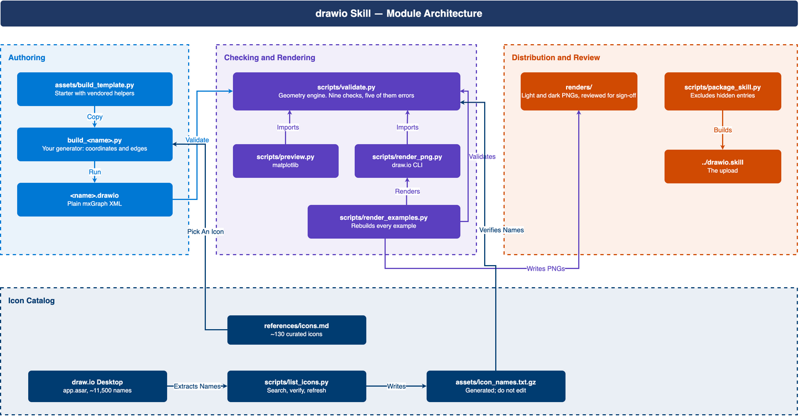

# Architecture

How the skill is put together, and why the pieces sit where they do. For how to
*use* it, read [SKILL.md](../SKILL.md); for how to refine and ship it, read
[CONTRIBUTING.md](CONTRIBUTING.md).



Regenerate the picture whenever the module structure changes:

```bash
python docs/build_architecture.py
python scripts/validate.py docs/architecture.drawio
python scripts/render_png.py docs/architecture.drawio
```

The source (`architecture.drawio`), its generator (`build_architecture.py`) and
the render are all committed, so the diagram can be checked against the code
rather than trusted.

## The shape of it

There is no application and no library. The skill is four groups of stdlib
Python that share one geometry module.

### Authoring — a generator per diagram

`assets/build_template.py` is a starter you copy. It vendors its helpers —
`container`, `box`, `edge`, `sub`, `desc`, plus the icon set — inline, so a
generator is one self-contained file that imports only `xml.etree`. Running it
writes plain mxGraph XML.

Nothing imports the template. Each generator owns its copy and drifts from it as
the diagram needs; the copy stays diffable because both are `ruff format`-clean
at 88 columns.

### Checking — one geometry module, three consumers

`scripts/validate.py` is the only place diagram geometry is interpreted. It
parses a `.drawio` file into `Box` and `Edge` records, reconstructs each edge's
rendered polyline, and runs nine checks:

| Severity | Checks |
| --- | --- |
| Error — fails the build | `CROSSING`, `OVERLAP`, `TEXT_OVERLAP`, `LABEL_OVERLAP`, `DANGLING` |
| Warning — prints only | `LABEL_BOX_OVERLAP`, `SHORT_LABELLED_EDGE`, `DIAGONAL`, `UNKNOWN_ICON` |

The warnings all rest on an estimate — a route the validator cannot fully
verify, or a character-count label width — which is why they do not block.

Two decisions shape the rest of the module:

- **Routes are reconstructed.** draw.io does not store the route it draws. It
  stores anchors and waypoints and applies `orthogonalEdgeStyle` at render time.
  `edge_polyline` reproduces that, including squaring the source and target
  stubs into the L-bends draw.io renders. Every check runs on the reconstructed
  polyline, so what is checked is what is drawn.
- **Thresholds are module constants.** `EDGE_BUFFER`, `ORTHO_TOL`,
  `MIN_OVERLAP`, `TITLE_BAND_HEIGHT`, `LABEL_PER_CHAR_PX`,
  `LABEL_BOX_MIN_OVERLAP` and the rest sit documented at the top of the file,
  and every function defaults to them. Tuning for a denser diagram is a one-line
  change in one place.

`scripts/preview.py` imports that geometry rather than re-deriving it, so the
preview shows exactly what the checks see. It draws with matplotlib and is
approximate. `scripts/render_png.py` shares nothing with the validator — it
hands the `.drawio` file to the draw.io Desktop CLI, which does its own parsing
and renders pixel-accurately. That is the point of keeping both: one shows the
validator's view of the diagram, the other shows draw.io's.

`scripts/render_examples.py` combines the validator with the CLI renderer — it
imports `validate` and `render_png` (not `preview`), rebuilds every
`examples/build_*.py`, validates the result, and renders the clean ones into
`renders/` in light and dark. A diagram with errors is reported and not
rendered.

### The icon catalog — one source, one generated index

`references/icons.md` is both the model-facing catalog and the machine-readable
source: `list_icons.py` parses its tables, so there is no second copy to drift.
It holds 128 curated entries with brand colours, keyed as `family-name`
(`aws-lambda`). The generator helpers take the colon form (`aws:lambda`); the
mismatch between the two is tracked as KI-01.

`assets/icon_names.txt.gz` is the other half — every name draw.io ships, about
11,500 of them, extracted from a draw.io Desktop `app.asar` by
`list_icons.py --refresh`. `UNKNOWN_ICON` checks against it, which is what turns
a mistyped stencil (draw.io renders those as an empty shape and reports nothing)
into a warning with a did-you-mean. The file is written with `mtime=0`, so an
unchanged refresh leaves it byte-identical instead of writing a fresh binary
blob.

Only `--verify`, `--refresh` and `--dump-names` need draw.io installed. Building
and validating a diagram never does.

### Distribution — the archive and the renders

`scripts/package_skill.py` writes `../drawio.skill`, beside the skill folder so
the archive never contains a stale copy of itself. It excludes hidden entries by
rule rather than by name, plus `renders/`, `docs/` and `__pycache__`. What
remains is what a user installs.

`renders/` is committed and reviewed at the end of a phase.
[CLAUDE.md](../CLAUDE.md) records why it is kept in the repo and out of the
archive.

## What runs where

| Piece | Needs |
| ------- | ------- |
| A generator, `validate.py`, `list_icons.py --search`, `package_skill.py` | Python 3.10+, stdlib only |
| `preview.py` | matplotlib |
| `render_png.py`, `render_examples.py` | draw.io Desktop CLI on `PATH`, or the macOS app bundle at `/Applications/draw.io.app` |
| `list_icons.py --verify` / `--refresh` / `--dump-names` | draw.io Desktop **installed** — it reads `app.asar` from the app bundle directly (override with `$DRAWIO_APP`), and never touches `PATH` |

The split matters in a sandbox. Inside an isolated VM the host's `drawio` binary
is usually unreachable, so `render_png.py` reports "drawio CLI not found" and
`preview.py` is the available path. In a project venv without matplotlib it is
the other way round.

## Tests

`pytest` covers each validator check with a minimal fixture that exhibits
exactly one violation, from `tests/fixtures/builders.py`. Alongside them sit the
guards that matter more: fixtures that must *not* fire — stub-squaring,
point-anchored edges, and entering a container from above — plus
`build_text_overlap_inside`, which asserts the container exemption stayed narrow.

`test_render_png.py` fakes `subprocess.run` at the system boundary, so the real
`render()` path runs without the draw.io CLI installed. `test_package_skill.py`
asserts the shape of the archive, not the mechanics of zipping.
`test_three_tier_example_validates_clean` builds the bundled example end to end.

## Known limits of the approach

The validator is a 2D geometric check. It says nothing about colour, contrast,
wording, or whether a managed service was drawn inside the wrong trust boundary,
and it cannot see whether a label that technically fits looks cramped.
[SKILL.md](../SKILL.md) lists the blind spots in full under "Limitations". That
is why rendering the PNG and looking at it is a step of the loop.
